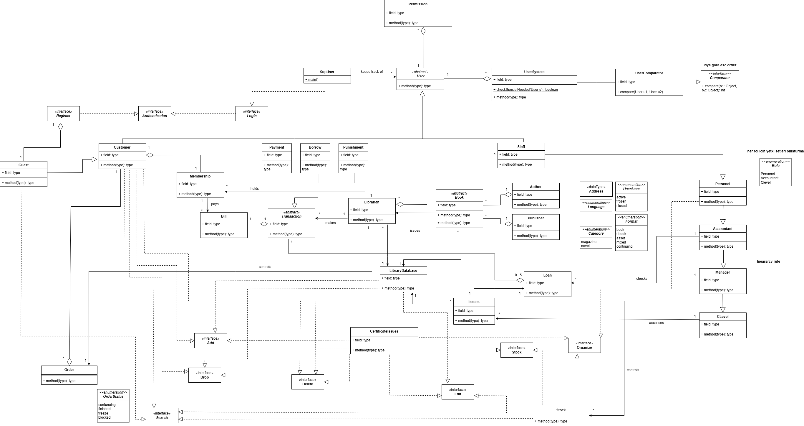
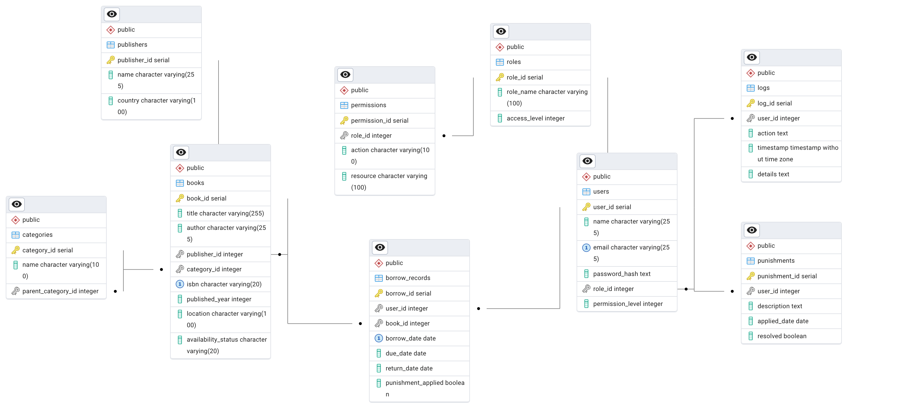

# KÜTÜPHANE YÖNETİM SİSTEMİ

## 1. Proje Genel Tanımı

- Bu proje, bir kütüphane yönetim sistemi oluşturmayı amaçlar. Sistem:
  - Java Swing ile masaüstü arayüz sunar,
  - Spring Boot mikroservis mimarisi ile backend işlemlerini yönetir,
  - PostgreSQL veritabanı kullanır,
  - REST API ile HTTP tabanlı haberleşme sağlar,
  - API üzerinden veri aktarımında hem JSON hem de Google Protocol Buffers (Protobuf) destekler,
  - Eureka (Netflix OSS) ile servis keşfi sağlar,
  - Yetkilendirme, roller arası erişim hiyerarşisi ve işlem hakları ile detaylı bir kullanıcı kontrolü içerir.

## 2. Kullanılan Teknolojiler ve Rolleri

### 2.1. UML  
**Kullanıcı Roller ve Yetkileri**

- **Customer**  
  Sistemin temel kullanıcılarıdır.  
  Guest sınıfı üzerinden türeyerek gelir.  
  Kayıt işlemi sonrası Customer olur.  
  Sistemde üyelik başlatabilir, ödeme yapabilir, kitap ödünç alabilir ve gerektiğinde ceza alabilir.

- **Guest**  
  Sisteme kaydolmamış, yalnızca sınırlı erişimi olan kullanıcılardır.  
  Register arayüzü aracılığıyla müşteri olabilir.

- **Personel ve Alt Rolleri (Enum: Role)**  
  Personel sınıfı, tüm kütüphane çalışanlarını kapsar.  
  - Staff → Teknik işlemleri kontrol eder (stok, kitap düzenleme vs.)  
  - Accountant → Fatura işlemleri ile ilgilenir.  
  - Manager → Personel yönetimi, üst düzey kontroller.  
  - CLevel → CEO gibi en üst düzey erişimi olan kullanıcılar. Sistemde tam erişim hakkına sahiptir.

- **Permission**  
  Kullanıcının hangi katlara erişebileceğini ya da hangi işlemleri yapabileceğini belirler.  
  Erişim kısıtlaması için kullanılır. Örneğin bir kullanıcı sadece 1. kata erişebilir.  
  Permission sınıfı, abstract.User üzerinde çalışır ve UserSystem ile ilişkilidir.

- **Role**  
  Sistemdeki rollerin sabit bir tanımıdır: Personel, Accountant, CLevel

**Yayınlar ve Kitap Yönetimi**

- **Book (Abstract Class)**  
  Sistemdeki tüm yayın türlerinin temelidir.  
  Author ve Publisher nesneleri ile ilişkilidir.  
  Her kitap, bir Language, Category, Format bilgisine sahiptir.

- **Category**  
  Yayın türlerini tanımlar: book, magazine, news, asset, mixed, continuing.

- **Format**  
  Yayının dijital ya da fiziksel formatı: book, ebook, asset, mixed.

- **Author ve Publisher**  
  Kitabın yazar ve yayınevi bilgilerini barındıran sınıflardır.  
  Book sınıfıyla ilişkilidirler.

**İşlem ve Veritabanı Yönetimi**

- **Transaction (Abstract Class)**  
  Payment, Borrow, Punishment gibi işlemleri kapsar.  
  Bu işlemleri Librarian yapar.

- **Librarian**  
  Kitap verme (issue), iade alma, ceza uygulama gibi işlemleri gerçekleştirir.  
  Sistemdeki işlemleri yönetir, LibraryDatabase üzerinde kontrol sahibidir.

- **LibraryDatabase**  
  Kitap, stok ve ödünç işlemlerinin saklandığı merkezi yapı.  
  Librarian tarafından kontrol edilir.

- **Loan ve Issue**  
  - Loan: Ödünç alma sürecinin detaylarını kontrol eder.  
  - Issue: Kitabın kullanıcıya verildiği durumu ifade eder.

**Arayüzler ve Kullanıcı Etkileşimleri (Interfaces)**

- Register, Login, Authentication: Giriş ve kayıt işlemleri için gerekli kullanıcı arayüzleri.  
- Add, Delete, Edit, Drop, Search, Organize, Stock: Kitap, stok ve kullanıcı yönetimi işlemlerini kontrol eden işlevsel arayüzlerdir.

### UML Diyagramı

---

### 2.2. Database (SQL- UTF-8)

- **DB Server:** PostgreSQL 17  
- **Interface:** pgAdmin4

9 adet tablo oluşturuldu:

1. **Roles:**  
   Rol tanımları yapılır, yetki seviyesi 1-10 aralığında sınırlandırdık (check).

2. **Permissions:**  
   Rollerin hangi kaynak üzerinde ne işlem yapabileceği tanımladık, silinen rollerle birlikte ilişkili izinler de silinir (cascade).

3. **Users:**  
   Kullanıcı bilgileri yer alır, e-posta benzersizdir, yetki seviyesi sınırlandırdık ve her kullanıcı bir role bağlı.

4. **Categories:**  
   Kategoriler hiyerarşik şekilde yani üst kategori silinirse bağlantı kopar (set null).

5. **Publishers:**  
   Yayıncı bilgileri içerir, silindiklerinde kitap kayıtları korunur (set null).

6. **Books:**  
   Kitap bilgileri saklanır, ISBN benzersizdir, durum bilgisi sınırlıdır, yayınevi ve kategori ilişkileri esnektir.

7. **Borrow_Records:**  
   Ödünç alma bilgileri tutulur, aynı kitap aynı gün aynı kullanıcıya birden fazla kez verilemez (unique).

8. **Punishments:**  
   Kullanıcılara uygulanan cezalar kaydedilir, kullanıcı silinince cezalar da silinir, çözülme durumu varsayılan olarak olumsuzdur.

9. **Logs:**  
   Kullanıcı aktiviteleri kaydedilir, kullanıcı silinse de kayıt korunur (set null), zaman bilgisi otomatik atanır.

**Amaç:**  
Kalıcı veri saklama (user, book, transaction vb.)

**Neden Seçildi:**  
Open source, güçlü veri bütünlüğü, JSONB ve geniş veri tipi desteği (protobuff json zorunlu).

**Kullanım:**  
Her mikroservis kendi veritabanı şemasına sahip.

---

### ER (Entity-Relationship) Diyagramı

Sistemdeki tabloları ve aralarındaki ilişkileri gösteren ER diyagramı aşağıdadır:

### 2.3. C4 Modeli (Context - Container - Component - Code)

#### Context Diyagramı

Sistem dışı kullanıcılar ve sistem arasındaki ilişkiyi gösterir.

Sisteme kimlerin eriştiği (Guest, Customer, Staff, Manager/CLevel) ve sistemin ne yaptığı (kitap görüntüleme, arama, ödünç alma/iade, ceza uygulama, yetki bazlı erişim) burada açıklanır.

#### Container Diyagramı

Sistemin hangi uygulamalardan ve servislerden oluştuğunu gösterir:

- **UI (Java Swing)**  
  Kullanıcıların masaüstü üzerinden eriştiği arayüz.

- **API Gateway (Spring Cloud Gateway)**  
  Tüm servislerin dış dünyaya açıldığı API yönlendirme ve güvenlik katmanı.

- **User Service (Spring Boot + JPA)**  
  Kullanıcıya ait CRUD işlemleri (ekleme, düzenleme, silme, listeleme).

- **Book Service (Spring Boot + JPA)**  
  Kitap, yayınevi, kategori gibi yayın nesneleri ile ilgili işlemleri yönetir.

- **PostgreSQL (DBMS)**  
  Kalıcı veri saklama için kullanılan ilişkisel veritabanı.

- **Eureka Server (Netflix Eureka)**  
  Mikroservislerin birbirini bulmasını ve haberleşmesini sağlayan servis keşif aracı.

#### Component Diyagramı

Her bir container içindeki alt bileşenleri gösterir.  
Örnek olarak **Book Service** bileşenleri:

- **BookController**  
  HTTP isteklerini karşılar  
  (Örn: `GET /books`, `POST /add`)

- **BookServiceImpl**  
  İş mantığının tanımlandığı ana servis sınıfıdır.

- **BookRepository**  
  JPA ile veritabanı işlemlerini gerçekleştirir.

- **BookMapper**  
  DTO ↔ Entity dönüşümlerinin yapıldığı katmandır.

- **Book**  
  JPA Entity sınıfı kitap nesnesini temsil eder.

  ## 4C Mimarisi Diyagramı

